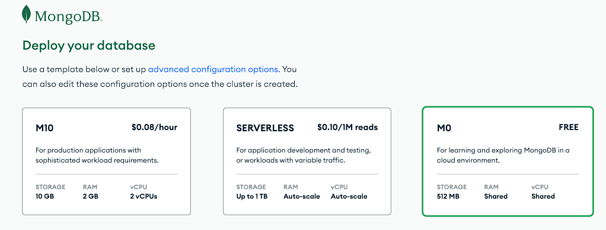

# MongoDB-Atlas-Tutorial

A tutorial on MongoDB using Atlas for CSCI 435

ADD description on software involved on and goal / result of the tutorial.

## Installation

Start by creating an account with the Atlas cloud platform at the following link. 

After verifying your email, you will be prompted with a few questions to personalize your account. Most of these settings are not important and can be left as default except for the pricing model.

When you are prompted to ***deploy your database***, select ***M0***, the free version which is designed to learn and explore what MongoDB has to offer.

> https://www.mongodb.com/cloud/atlas/register

This will begin to create your first cluster which may take a few minutes.

<b>Further Resources (optional)</b>

- [MongoDB Documentation](https://www.mongodb.com/docs/)
- [Clusters](https://www.mongodb.com/basics/clusters)

## Setup and Exploration

### Load Sample Data

Navigate to the ***Database*** tab and click ***Load sample data***. This will take a few minutes, so you can move to the next step while this is happening.

### Setup External DB Access

We will now configure our database so that we can access it externally.

Navigate to the ***Database Access*** tab and click ***Add New Database User***.
- Create a username and password
- Under Database User Priviledges > Built-in Role, select ***Read and write any to any database***
- Click ***Add User***

Navigate to the ***Network Access*** tab and click ***Add IP Address***. This is a security measure to prevent non-authrorized IP addresses from connecting to our cluster.
?????????????

### Browse our Sample Data

Navigate back to the ***Database*** tab and click ***Browse collections***. This page shows all of our databases and the collections they contain. Selecting a database and then one of the collections inside of it will display all of its fields.

We can filter to find specific entries directly from this window.

**Try it out:**
- Go to the ***sample_airbnb*** database and the ***listingsAndReviews*** collection
- In the filter bar, paste the following query: `{"accommodates": {$gt: 10}}`
- This will display only airbnb listing which accommodate greater than 10 people

<b>Further Resources (optional)</b>

- [Databases and Collection](https://www.mongodb.com/docs/manual/core/databases-and-collections/)
- [Filtering](https://www.mongodb.com/docs/compass/current/query/filter/)

## Creating our First Database