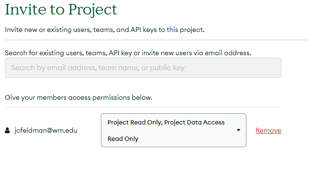

# MongoDB Atlas Tutorial

This is a tutorial for CSCI 435 on using MongoDB with Atlas. MongoDB is a NoSQL, document database. Atlas is MongoDB's cloud platform which can be used to easily deploy and manage MongoDB databases.

In this tutorial, you will be walked through the process of setting up MongoDB Atlas, querying data, and creating your own data. At the end, you will have created a database for our school. You will have created two collections in this database and a couple document entries for each.

## Installation

Start by creating an account with the Atlas cloud platform at the following link. 

> https://www.mongodb.com/cloud/atlas/register

After verifying your email, you will be prompted with a few questions to personalize your account. Most of these settings are not important and can be left as default except for the pricing model.

When you are prompted to ***deploy your database***, select ***M0***, the free version which is designed to learn and explore what MongoDB has to offer.


This will begin to create your first cluster which may take a few minutes.

<details><summary><b>Further Resources (optional)</b></summary>

- [MongoDB Documentation](https://www.mongodb.com/docs/)
- [Clusters](https://www.mongodb.com/basics/clusters)

</details>

## Setup and Exploration

### Load Sample Data

Navigate to the ***Database*** tab and click ***Load sample data***. This will take a few minutes.

### Browse our Sample Data

Navigate back to the ***Database*** tab and click ***Browse collections***. This page shows all of our databases and the collections they contain. Selecting a database and then one of the collections inside of it will display all of its documents.

Go to the ***sample_airbnb*** database and the ***listingsAndReviews*** collection. This collection contains mock data for airbnb listings and each one's corresponding reviews. We can filter to find specific entries directly from this window.

**Try it out:**
- In the filter bar, paste the following query: `{"accommodates": {$gt: 10}}`
- This will display only airbnb listing which accommodate greater than 10 people

**A more complicated query:**
- Try using the following query: 
  ```
  {
    "property_type": "House",
    "bedrooms": { "$gte": 4 },
    "amenities": {
      "$all": [
        "Pool",
        "Air conditioning"
      ]
    },
    "price": { "$gte": 50, "$lte": 500 }
  }
  ```
- This one filters for properties which are houses, have atleast 4 bedrooms, contain all of the listed amenities, and have a price between 50 and 500 dollars.

<details><summary><b>Further Resources (optional)</b></summary>

- [Databases and Collection](https://www.mongodb.com/docs/manual/core/databases-and-collections/)
- [Filtering](https://www.mongodb.com/docs/compass/current/query/filter/)

</details>

## Creating New Data

We can also create new data directly in the Atlas web page.

#### 1. Create a new database and collection
- Click ***Create Database*** above our current list of databases.
- Enter `school` for ***Database name*** and `course` for ***Collection name***.
- Click ***Create***.

#### 2. Add data
- Make sure our new course collection is selected.
- Click ***Insert Document*** on the right side of the page.
- Select the view option with brackets so we can type our data in as JSON.

- Paste the following fields in after the id field:
  ```
  ,
  "name": "Software Engineering",
  "CRN": 12335,
  "days": ["M", "W"]
  ```
  
- Come up with one more field that would make sense to include in a document for a course and add it.
- Click ***Insert***

We now have our Software Engineering class listed as a document in our course collection. Go ahead and add all of the other courses you are taking this semester following the same procedure. Note that you can add multiple documents at once by surrounding them with `[]` to insert an array of documents.

#### 3. Try making your own collection
- Hover over the ***school*** database in the list of databases on the left and click the plus sign.
- Come up with 1 new collection that would make sense to include in the school database and add it. Some examples: building, student, instructor, etc.
- Come up with some fields that would make sense to include in this collection and insert 3 documents with these fields.

<details><summary><b>Further Resources (optional)</b></summary>

- [Handling Documents in Atlas](https://www.mongodb.com/docs/atlas/atlas-ui/documents/)

</details>

## Submission

Share your MongoDB Atlas project with Professor Poshyvanyk and Alejandro so they can check off that you followed the tutorial.


1. Navigate to the ***Invite to Project*** button in the top right.

2. Enter their emails and for access permissions, make sure to select ***Read only*** and ***Project data access read only***.


3. Click ***Invite to Project***.

<details><summary><b>Further Resources (optional)</b></summary>

Here are some resources for working on your MongoDB Atlas cluster with Python for anyone interested in diving deeper into MongoDB.
- [Working with MongoDB and Python](https://www.mongodb.com/languages/python)
- [VSCode Extension](https://code.visualstudio.com/docs/azure/mongodb)

</details>

## Sources

Resources used to design this tutorial:
- [MongoDB Documentation](https://www.mongodb.com/docs/)
- [Official MongoDB Atlas Tutorial](https://www.mongodb.com/basics/mongodb-atlas-tutorial)
- [Intro to MongoDB Atlas JumpStart Video](https://www.youtube.com/watch?v=xrc7dIO_tXk)
- [Getting started with MongoDB Atlas Video](https://www.youtube.com/watch?v=bBA9rUdqmgY)